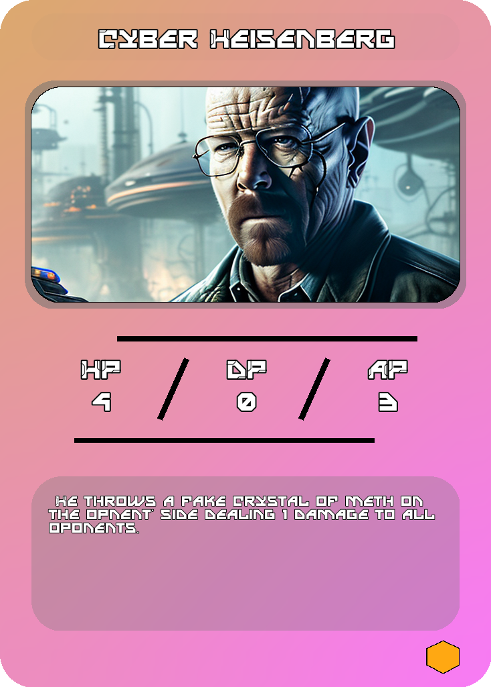

Principles of CyberArena
========================

Overview
--------

CyberArena is a game where you can fight against other players in an intense card battle.

This game is a fight between two players, each player has a deck of cards and life points.
The goal of the game is to reduce the opponent's life points to 0.
You will do that by playing cards from your hand and use their effects and attacks to defeat your opponents.

.. note::
    The game is still in development and is not yet finished.

    In the future, players will be able to create their own decks.

Game process
------------
The game process is divided into 3 phases:

- First, when the player starts the matchmaking and finds an opponent, they are both given a standard deck of 30 cards.
- Then, the game starts and both players are presented with the arena. The first player to play is chosen randomly, and is given the first turn.
- At start, each player start with 1 cristal to deploy his cards with. Each player, when it's his turn, can play a card from his hand aswell as use his deployed cards to attack the opponent's cards or player. Player can either deploy a character card, or a spell card that applies various effects
- The game can now proceed with, at each turn, an increase in the base number of cristals by 1.
- The game ends when one of the players life points reach 0 or when one of the players forfeits the match.

Cards
-----

Here an example of a card:

Attributes
^^^^^^^^^^

A card consists of 4 attributes:

The health points shows how much damage a card can take before being destroyed.
When a card's health points reach 0, it is destroyed.
The attack points shows how much damage a card can deal to the opponent's cards or player.
The cost shows how many cristals are needed to deploy the card.
The defense points shows how much damage a card can take from an attack before loosing health points.

Factions
^^^^^^^^

.. note::
    The relation between cards is not implemented yet.

The game cards are divided into 4 factions :

    - The Humans
    - The Mutants
    - The Aliens
    - The Machines

Certain combinations of cards can be used to create synergies between cards if they are from the same faction.
For instance, having 3 humans on your side of the board at the same time will give you a bonus of 1 cristal per turn.
Having 3 aliens on your side of the board at the same time will give you 2 free shitty minions to spam the board
Having 3 machines on your side of the board at the same will increase the defense of all your machines by 1.
Having 3 mutants on your side of the board at the same will increase the attack of all your mutants by 1.

Board
-----

The Board is divided into 2 sides, the player's side and the opponent's side.
The player can only deploy cards on his side of the board,and can only attack the opponent's side of the board.

Deck
----

The deck is the initial set of cards that the player has at the start of the game.
The deck is composed of 20 cards but can be modified in .env file.

.. warning::
    The custom deck function is not implemented in the game.
    For the moment, the player is given a standard deck.

.. note::
    In the future, player will be able to create their own deck.
    They will be able to choose card thei have to put in their deck.

Economy
-------

The in game economy is base on CyberCredits.

CyberCredits are the game currency witch can be use in different ways:
    - Buy new cards
    - By trading cards
    - Participate in tournaments (entry fee)
    - Participate in lotteries to win big prices.

And they can be obtained in different ways:
    - By completing a match (win or lose)
    - By winning a match
    - By winning games in tournaments
    - By buying them with real money
    - By login in the game every day
    - By completing daily quests

.. note::
    The CyberCredits system is not implemented yet.
